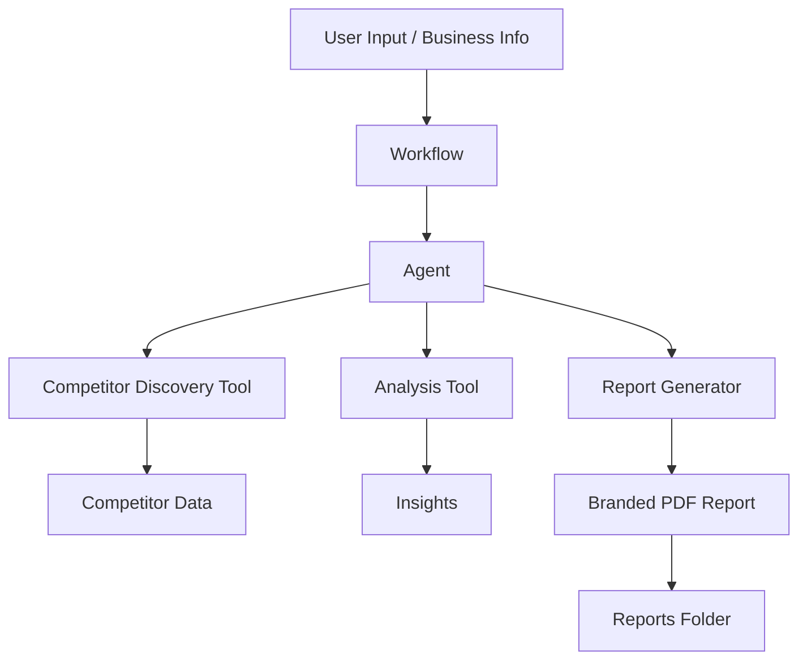
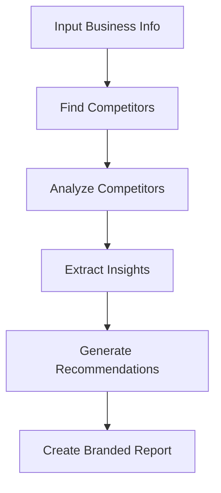

# AI Competitor Analysis Agent Workflow

An AI-powered system that automates competitor research, identifies market opportunities, and generates branded reports using a modular architecture.

## Overview

This project implements a production-style AI agent using the WAT framework (Workflows, Agents, Tools).

It is designed to:
- Discover competitors automatically
- Analyze positioning, pricing, and messaging
- Identify business opportunities and gaps
- Generate fully branded PDF reports

## Architecture

The system is built using three layers:

- Workflows → Define what needs to be done  
- Agents → Coordinate decisions and execution  
- Tools → Execute deterministic tasks (scraping, processing, reporting)

## Features

- AI-driven competitor discovery
- Market positioning analysis
- Opportunity identification
- Branded report generation (logo, colors, typography)
- Monthly monitoring capability

## Project Structure

.tmp/            # Temporary files  
tools/           # Execution scripts  
workflows/       # Workflow definitions  
brand_assets/    # Logo, colors, typography  
reports/         # Final generated reports  
CLAUDE.md        # Agent instructions  

## Use Case

Built for AI automation businesses targeting SMBs to:
- Track competitors
- Improve positioning
- Scale decision-making with AI

## Tech Stack

- Python (tools)
- AI APIs (OpenAI / Anthropic / Perplexity)
- Workflow-based architecture

## System Architecture Diagram

## Workflow Process

